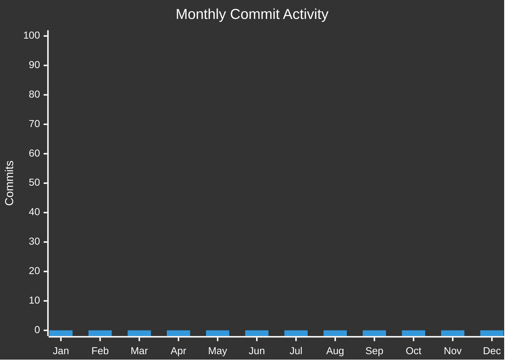
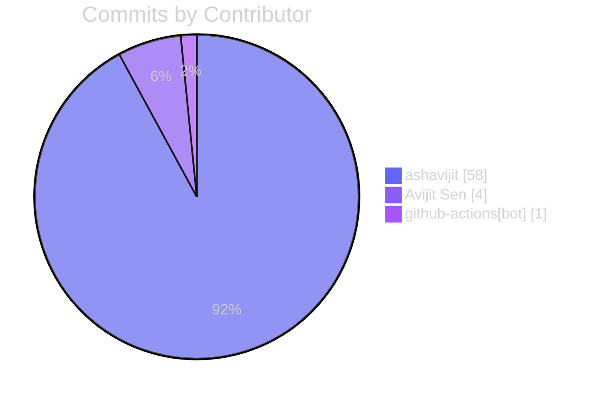

# 👥 Contributors

Thanks to all the amazing people who have contributed to FluxFile! 🎉

---

## 🏆 Top Contributors

| # | Avatar | Contributor | Commits | Lines Added | Lines Deleted |
|---|--------|-------------|---------|-------------|---------------|
| 🥇1 |  | **[@as2440](https://github.com/as2440)** | `58` | +14154 | -1959 |
| 🥈2 |  | **[@as2440](https://github.com/as2440)** | `4` | +4 | -2 |
| 🥉3 |  | **[@github-actions[bot]](https://github.com/github-actions[bot])** | `1` | +0 | -0 |

---

## 📊 Contribution Statistics

### Commits Over Time

### Contribution by Author

---

## 🕐 Recent Activity

### Last 10 Commits

| Date | Author | Commit | Message |
|------|--------|--------|---------|
| 2025-12-16 | **ashavijit** | [`b0024a9`](../../commit/b0024a9791738daf07c9a5fd31e5a5499eddf045) | docs: enhanced contributors workflow with colorful charts and detailed stats |
| 2025-12-16 | **github-actions[bot]** | [`968f91e`](../../commit/968f91e1283ce274bb6a65a0a860c0c6ee0d7170) | docs: update contribution graph |
| 2025-12-16 | **ashavijit** | [`ec0cc79`](../../commit/ec0cc79855aef871940310983c83e798ebd3ab48) | ci: add contributors workflow with Mermaid graphs |
| 2025-12-16 | **ashavijit** | [`45561c3`](../../commit/45561c30ed6f74c548522ad9ab6bc5cef67c47bb) | fix: disable Homebrew tap update (requires token setup) |
| 2025-12-16 | **ashavijit** | [`7353e80`](../../commit/7353e802a8543267fd016a207b1fd2200d9f9d41) | Merge branch 'feature/improvements-v2.3' |
| 2025-12-16 | **ashavijit** | [`30c61f1`](../../commit/30c61f1d7af45d17d38a166711f289f570b525c4) | feat: add release infrastructure with checksums, Homebrew, and Scoop support |
| 2025-12-16 | **ashavijit** | [`62bf3ec`](../../commit/62bf3ec588867f1169b117d2c4aab92379055574) | docs |
| 2025-12-15 | **ashavijit** | [`802e610`](../../commit/802e61017e0a50e6ca1e9f5941944b4920ed0122) | feat: improve lock file with atomic writes, checksums, stale detection |
| 2025-12-15 | **ashavijit** | [`cc76df2`](../../commit/cc76df21cd715de953a626cd6e10bfccec1fdf2f) | docs: revamp README with modern design, benchmarks, emoji headers |
| 2025-12-15 | **ashavijit** | [`b8d9ad4`](../../commit/b8d9ad43db59540c37bde57c896820879017a953) | feat: add benchmark tests for lexer, parser, graph, executor, cache, ast |
---

## 📈 Code Frequency

---

### 💜 Want to Contribute?

Check out our [Contributing Guide](CONTRIBUTING.md) to get started!

---

*Auto-generated on $(date -u '+%Y-%m-%d %H:%M UTC')*
