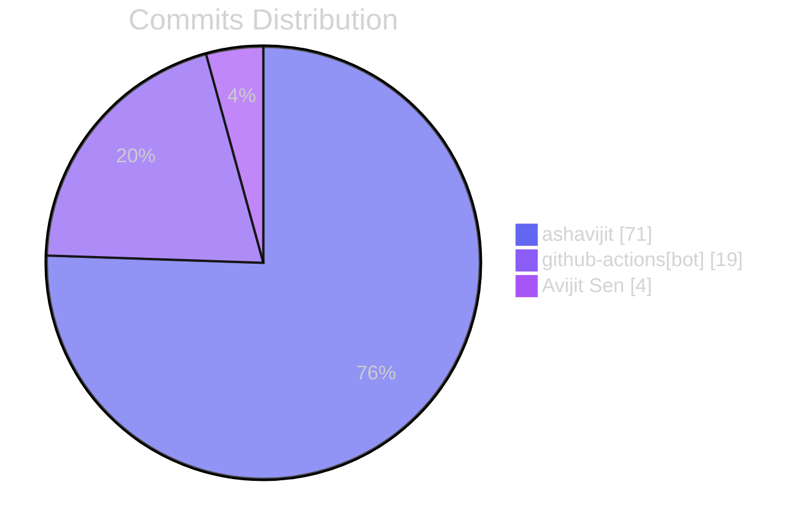

# 👥 Contributors

Thanks to all the amazing people who have contributed to FluxFile! 🎉

---

## 🏆 Top Contributors

| # | Avatar | Contributor | Commits | Lines Added | Lines Deleted |
|:-:|:------:|-------------|:-------:|:-----------:|:-------------:|
| 🥇 1 |  | **[@ashavijit](https://github.com/ashavijit)** | 71 | +14489 | -2027 |
| 🥈 2 |  | **[@github-actions[bot]](https://github.com/github-actions[bot])** | 19 | +0 | -0 |
| 🥉 3 |  | **[@avijit-sen](https://github.com/avijit-sen)** | 4 | +4 | -2 |

---

## 📊 Contribution Statistics

### Commits by Author

```mermaid
%%{init: {'theme': 'dark', 'themeVariables': { 'pie1': '#6366f1', 'pie2': '#8b5cf6', 'pie3': '#a855f7', 'pie4': '#d946ef', 'pie5': '#ec4899', 'pie6': '#f43f5e', 'pie7': '#f97316', 'pie8': '#eab308'}}}%%
pie showData
    title Commits Distribution
    "ashavijit" : 71
    "github-actions[bot]" : 19
    "Avijit Sen" : 4
```

---

## 🕐 Recent Activity

### Last 15 Commits

| Date | Author | Commit | Message |
|:----:|--------|:------:|---------|
| `2026-03-15` | github-actions[bot] | [`680c055`](../../commit/680c05514504843d44f0f4385de2e29529b0aaf3) | docs: update contributors |
| `2026-03-08` | github-actions[bot] | [`c516023`](../../commit/c516023c50b35a2cf429e504649fc4a8ffa39495) | docs: update contributors |
| `2026-03-01` | github-actions[bot] | [`18c50a5`](../../commit/18c50a5d38de0b22f917c9e69de8ef61f5cd036f) | docs: update contributors |
| `2026-02-22` | github-actions[bot] | [`ba94bb0`](../../commit/ba94bb027d3964cb533b726bf0202d72bde3fed8) | docs: update contributors |
| `2026-02-15` | github-actions[bot] | [`2415f98`](../../commit/2415f98d076b20e35b79b6be25d739025d9b09ff) | docs: update contributors |
| `2026-02-08` | github-actions[bot] | [`9eb75cf`](../../commit/9eb75cf4cbabc104325a65c183892069eed9809d) | docs: update contributors |
| `2026-02-01` | github-actions[bot] | [`901ff8a`](../../commit/901ff8ab738569cff892b1b20d5a69e2571bc878) | docs: update contributors |
| `2026-01-25` | github-actions[bot] | [`627f653`](../../commit/627f6532509b441b7d1e8dedf7f11d62b16157ea) | docs: update contributors |
| `2026-01-18` | github-actions[bot] | [`0aaeddc`](../../commit/0aaeddc162a2a2c55eddaeb12f88550bb433215d) | docs: update contributors |
| `2026-01-11` | github-actions[bot] | [`606ad54`](../../commit/606ad54d183130b6427da6845bfc3bdd142f6412) | docs: update contributors |
| `2026-01-04` | github-actions[bot] | [`5e1db43`](../../commit/5e1db43716da3dcad2942749365113068f696a97) | docs: update contributors |
| `2025-12-28` | github-actions[bot] | [`a591569`](../../commit/a591569cd40e4f1eae6037834b8d7637a1c7a0e0) | docs: update contributors |
| `2025-12-21` | github-actions[bot] | [`77a52ef`](../../commit/77a52ef7603a0b51cd49a34b13ba9c119d172e28) | docs: update contributors |
| `2025-12-16` | github-actions[bot] | [`950f168`](../../commit/950f168264e10af3502101ae6331d66d0f7a108f) | docs: update contributors |
| `2025-12-16` | github-actions[bot] | [`da0ddb8`](../../commit/da0ddb8b3aecbfe1f91464e464440bccfda6ea9b) | docs: update contributors |
---

### Commit Timeline

```mermaid
%%{init: {'theme': 'dark', 'themeVariables': { 'primaryColor': '#6366f1'}}}%%
timeline
    title Recent Development Activity
    2026-01-11 : 1 commits
    2026-01-18 : 1 commits
    2026-01-25 : 1 commits
    2026-02-01 : 1 commits
    2026-02-08 : 1 commits
    2026-02-15 : 1 commits
    2026-02-22 : 1 commits
    2026-03-01 : 1 commits
    2026-03-08 : 1 commits
    2026-03-15 : 1 commits
```

---

### 💜 Want to Contribute?

Check out our [Contributing Guide](CONTRIBUTING.md) to get started!

---

*Auto-generated on 2026-03-22 01:14 UTC*
