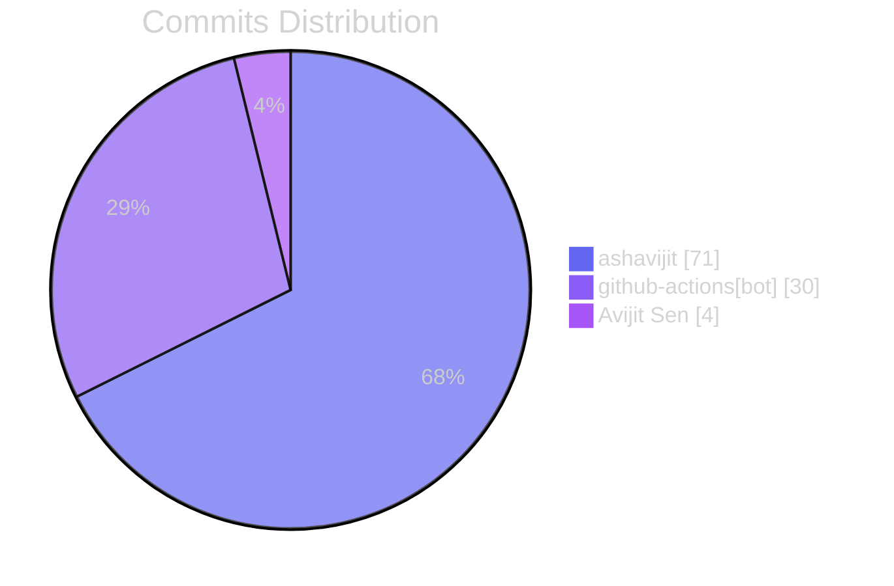

# 👥 Contributors

Thanks to all the amazing people who have contributed to FluxFile! 🎉

---

## 🏆 Top Contributors

| # | Avatar | Contributor | Commits | Lines Added | Lines Deleted |
|:-:|:------:|-------------|:-------:|:-----------:|:-------------:|
| 🥇 1 |  | **[@ashavijit](https://github.com/ashavijit)** | 71 | +14489 | -2027 |
| 🥈 2 |  | **[@github-actions[bot]](https://github.com/github-actions[bot])** | 30 | +0 | -0 |
| 🥉 3 |  | **[@avijit-sen](https://github.com/avijit-sen)** | 4 | +4 | -2 |

---

## 📊 Contribution Statistics

### Commits by Author

```mermaid
%%{init: {'theme': 'dark', 'themeVariables': { 'pie1': '#6366f1', 'pie2': '#8b5cf6', 'pie3': '#a855f7', 'pie4': '#d946ef', 'pie5': '#ec4899', 'pie6': '#f43f5e', 'pie7': '#f97316', 'pie8': '#eab308'}}}%%
pie showData
    title Commits Distribution
    "ashavijit" : 71
    "github-actions[bot]" : 30
    "Avijit Sen" : 4
```

---

## 🕐 Recent Activity

### Last 15 Commits

| Date | Author | Commit | Message |
|:----:|--------|:------:|---------|
| `2026-05-31` | github-actions[bot] | [`b1bb468`](../../commit/b1bb468da9f75126cd109a9970a4979fb315010c) | docs: update contributors |
| `2026-05-24` | github-actions[bot] | [`bcc6714`](../../commit/bcc6714c28114766a93a2adc60fe046efc5a63b4) | docs: update contributors |
| `2026-05-17` | github-actions[bot] | [`5904ffc`](../../commit/5904ffc360e3e4e337cbfea02887ef6d0c7f9333) | docs: update contributors |
| `2026-05-10` | github-actions[bot] | [`5ced795`](../../commit/5ced7950e441c0eb91e46df0345f4c11bee1ec42) | docs: update contributors |
| `2026-05-03` | github-actions[bot] | [`597b11c`](../../commit/597b11c84cb4030e6a6941c79224ad23170d1ac6) | docs: update contributors |
| `2026-04-26` | github-actions[bot] | [`51532a6`](../../commit/51532a6f1dc719b58b1ea754f52d85337482274f) | docs: update contributors |
| `2026-04-19` | github-actions[bot] | [`94c13e1`](../../commit/94c13e1f1f3f8bfbaa7175aad57b28cec987f1c1) | docs: update contributors |
| `2026-04-12` | github-actions[bot] | [`74326e6`](../../commit/74326e6f5a8619a0b965ef5cb1abcf2363a3c121) | docs: update contributors |
| `2026-04-05` | github-actions[bot] | [`25e6c30`](../../commit/25e6c30737430f0d6185f33ead3c3d42e67050be) | docs: update contributors |
| `2026-03-29` | github-actions[bot] | [`8d1773e`](../../commit/8d1773e683384e15423c6869dcb7484659e3fab8) | docs: update contributors |
| `2026-03-22` | github-actions[bot] | [`df664fc`](../../commit/df664fca076d424b43d54b844e62b3c06ef90b13) | docs: update contributors |
| `2026-03-15` | github-actions[bot] | [`680c055`](../../commit/680c05514504843d44f0f4385de2e29529b0aaf3) | docs: update contributors |
| `2026-03-08` | github-actions[bot] | [`c516023`](../../commit/c516023c50b35a2cf429e504649fc4a8ffa39495) | docs: update contributors |
| `2026-03-01` | github-actions[bot] | [`18c50a5`](../../commit/18c50a5d38de0b22f917c9e69de8ef61f5cd036f) | docs: update contributors |
| `2026-02-22` | github-actions[bot] | [`ba94bb0`](../../commit/ba94bb027d3964cb533b726bf0202d72bde3fed8) | docs: update contributors |
---

### Commit Timeline

```mermaid
%%{init: {'theme': 'dark', 'themeVariables': { 'primaryColor': '#6366f1'}}}%%
timeline
    title Recent Development Activity
    2026-03-29 : 1 commits
    2026-04-05 : 1 commits
    2026-04-12 : 1 commits
    2026-04-19 : 1 commits
    2026-04-26 : 1 commits
    2026-05-03 : 1 commits
    2026-05-10 : 1 commits
    2026-05-17 : 1 commits
    2026-05-24 : 1 commits
    2026-05-31 : 1 commits
```

---

### 💜 Want to Contribute?

Check out our [Contributing Guide](CONTRIBUTING.md) to get started!

---

*Auto-generated on 2026-06-07 02:31 UTC*
