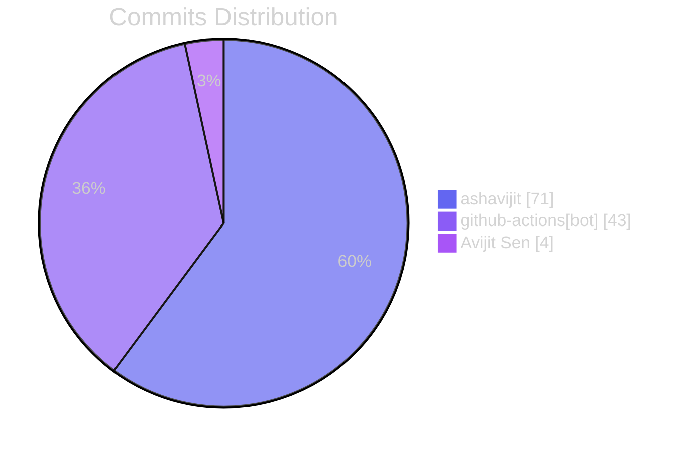
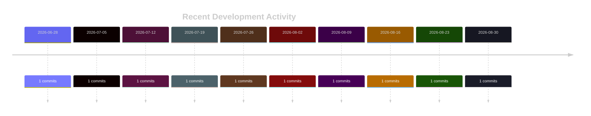

# 👥 Contributors

Thanks to all the amazing people who have contributed to FluxFile! 🎉

---

## 🏆 Top Contributors

| # | Avatar | Contributor | Commits | Lines Added | Lines Deleted |
|:-:|:------:|-------------|:-------:|:-----------:|:-------------:|
| 🥇 1 |  | **[@ashavijit](https://github.com/ashavijit)** | 71 | +14489 | -2027 |
| 🥈 2 |  | **[@github-actions[bot]](https://github.com/github-actions[bot])** | 43 | +0 | -0 |
| 🥉 3 |  | **[@avijit-sen](https://github.com/avijit-sen)** | 4 | +4 | -2 |

---

## 📊 Contribution Statistics

### Commits by Author

```mermaid
%%{init: {'theme': 'dark', 'themeVariables': { 'pie1': '#6366f1', 'pie2': '#8b5cf6', 'pie3': '#a855f7', 'pie4': '#d946ef', 'pie5': '#ec4899', 'pie6': '#f43f5e', 'pie7': '#f97316', 'pie8': '#eab308'}}}%%
pie showData
    title Commits Distribution
    "ashavijit" : 71
    "github-actions[bot]" : 43
    "Avijit Sen" : 4
```

---

## 🕐 Recent Activity

### Last 15 Commits

| Date | Author | Commit | Message |
|:----:|--------|:------:|---------|
| `2026-08-30` | github-actions[bot] | [`77dcf2d`](../../commit/77dcf2d4c8656d68cceb917077205c052b0741a0) | docs: update contributors |
| `2026-08-23` | github-actions[bot] | [`da76794`](../../commit/da76794dd1f28edf449a4eb471c859de9961be43) | docs: update contributors |
| `2026-08-16` | github-actions[bot] | [`72eb3a6`](../../commit/72eb3a6913430fac9fbe174da241cdec92ae29d7) | docs: update contributors |
| `2026-08-09` | github-actions[bot] | [`b46d8e7`](../../commit/b46d8e720480356491b192321e31de6f71f455a4) | docs: update contributors |
| `2026-08-02` | github-actions[bot] | [`28770ba`](../../commit/28770ba048b5378ca6e620e7f385ffc14af2628f) | docs: update contributors |
| `2026-07-26` | github-actions[bot] | [`bb244a3`](../../commit/bb244a30306fe73e305c3431e60b2a9e5c635534) | docs: update contributors |
| `2026-07-19` | github-actions[bot] | [`ea7d9c8`](../../commit/ea7d9c851a04afcae5a8737593db97a8964cfcae) | docs: update contributors |
| `2026-07-12` | github-actions[bot] | [`7534a99`](../../commit/7534a99bf6bfdef1e4ec29d219f1e2450c14e410) | docs: update contributors |
| `2026-07-05` | github-actions[bot] | [`6426e79`](../../commit/6426e79f5658a60def25f562240ef5f57114b833) | docs: update contributors |
| `2026-06-28` | github-actions[bot] | [`d817733`](../../commit/d8177337917ed7e2f73846220a98473f66bcff3c) | docs: update contributors |
| `2026-06-21` | github-actions[bot] | [`8653cfd`](../../commit/8653cfda5e8c0dcd207054b4e7e399c77963369a) | docs: update contributors |
| `2026-06-14` | github-actions[bot] | [`88fbac0`](../../commit/88fbac0579489b400757a2e9c62a3e8bbed5f586) | docs: update contributors |
| `2026-06-07` | github-actions[bot] | [`1118dd8`](../../commit/1118dd8bc471df4f2f72b9807deefee38d73fd8d) | docs: update contributors |
| `2026-05-31` | github-actions[bot] | [`b1bb468`](../../commit/b1bb468da9f75126cd109a9970a4979fb315010c) | docs: update contributors |
| `2026-05-24` | github-actions[bot] | [`bcc6714`](../../commit/bcc6714c28114766a93a2adc60fe046efc5a63b4) | docs: update contributors |
---

### Commit Timeline

```mermaid
%%{init: {'theme': 'dark', 'themeVariables': { 'primaryColor': '#6366f1'}}}%%
timeline
    title Recent Development Activity
    2026-06-28 : 1 commits
    2026-07-05 : 1 commits
    2026-07-12 : 1 commits
    2026-07-19 : 1 commits
    2026-07-26 : 1 commits
    2026-08-02 : 1 commits
    2026-08-09 : 1 commits
    2026-08-16 : 1 commits
    2026-08-23 : 1 commits
    2026-08-30 : 1 commits
```

---

### 💜 Want to Contribute?

Check out our [Contributing Guide](CONTRIBUTING.md) to get started!

---

*Auto-generated on 2026-09-06 01:48 UTC*
